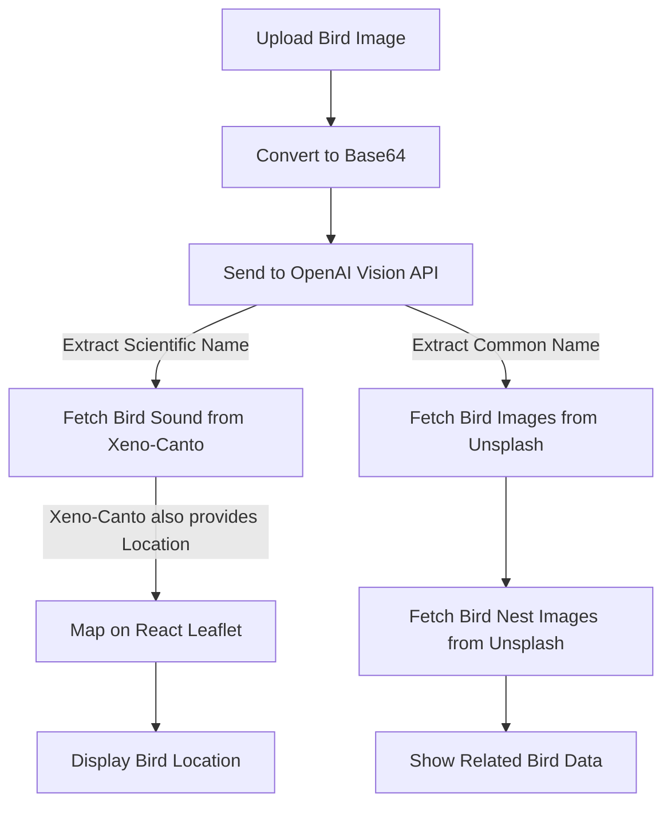

# 🦜 Bird Identifier: Image to Sound & Location

## 🌟 Project Aim
Bird identification has always been a challenge for nature enthusiasts, researchers, and photographers. While many apps can classify birds from images, none integrate **bird sounds, geographic locations, habitats and related images** seamlessly. This project bridges that gap by providing an innovative system that:

- **Identifies a bird species from an image** 📸
- **Retrieves its sound from Xeno-Canto** 🎶
- **Fetches additional images of birds and its habitat(nest) from Unsplash** 🖼️
- **Maps its habitat using Leaflet.js** 🌍

This is a **one-stop platform** for birdwatchers and researchers to gain an immersive experience in bird identification.

---

## 🔬 How It Works

### 🛠️ System Architecture

1. **User uploads an image of a bird**
2. **Image is converted to Base64 and sent to OpenAI's Vision API**
3. **OpenAI extracts relevant details:**
   - Scientific Name 🧪
   - Common Name 🏷️
   - Food
   - Common Predators
   - xenocantoPrompt
4. **xenocantoPrompt is used to fetch:**
   - **Bird sounds from Xeno-Canto** 🎵
   - **Longitude & Latitude from Xeno-Canto** 📍
5. **Common Name is used to fetch:**
   - **Similar bird images from Unsplash** 🖼️
   - **Bird nest images from Unsplash** 🏡
6. **Longitude & Latitude data are plotted using React Leaflet** 🗺️

### 📊 Flowchart Representation


---

## 🚀 Features
- **Bird Species Identification** 🆔 (via OpenAI Vision API)
- **Bird Sounds Retrieval** 🎶 (via Xeno-Canto API)
- **Similar Bird Images** 📷 (via Unsplash API)
- **Nest Images of the Bird** 🏡 (via Unsplash API)
- **Bird's Natural Habitat Mapping** 🗺️ (via React Leaflet)
- **Bird's Migration through animation**

---

## 🏗️ Tech Stack
- **Frontend:** React.js (Next.js optional), Leaflet.js
- **Backend:** Node.js, Express.js
- **APIs Used:**
  - OpenAI Vision API 🧠
  - Xeno-Canto API 🎵
  - Unsplash API 🖼️
  - Leaflet.js for mapping 🗺️

---

## 🔧 Installation & Setup

### 1️⃣ Clone the Repository
```sh
git clone https://github.com/yourusername/bird-identifier.git
cd bird-identifier
```

### 2️⃣ Install Dependencies
```sh
npm install fs dotenv express multer OpenAI dotenv  cors axios leaflet react-leaflet
```

### 3️⃣ Setup Environment Variables
Create a `.env` file and add your API keys:
```
OPENAI_API_KEY=your_openai_api_key
XENO_CANTO_API_KEY=your_xeno_canto_api_key
UNSPLASH_API_KEY=your_unsplash_api_key
```

### 4️⃣ Start the Application
nodemon index.js
```sh
create new terminal  
----
cd bird-identifier-web
npm start
```

---

## 📌 Usage
1. **Upload a bird image** 📤
2. **Wait for AI to process the image** ⏳
3. **View bird classification results** 🏷️
4. **Listen to its sound & explore related images** 🎵
5. **View the bird's habitat on a map** 🗺️

---

## 🎯 Future Enhancements
- ✅ **Offline bird sound storage** for quick playback
- ✅ **Community Contributions** for verified bird images
- ✅ **Integration with eBird API** for advanced birding data

---

## 🤝 Contributing
Want to improve this project? Contributions are welcome! 🎉
1. Fork the repository 🍴
2. Create a new branch 🌿
3. Make your changes and commit 🔧
4. Open a Pull Request 📌

---

## 📜 License
This project is **MIT Licensed**. Feel free to use and modify!

---

## 📬 Contact
soumithgundala@gmail.com
kanthalaraju@gmail.com
enduritarun@gmail.com
🚀 GitHub: [@soumithgundala](https://github.com/soumithgundala)

---

### ⭐ If you find this project helpful, give it a star ⭐!